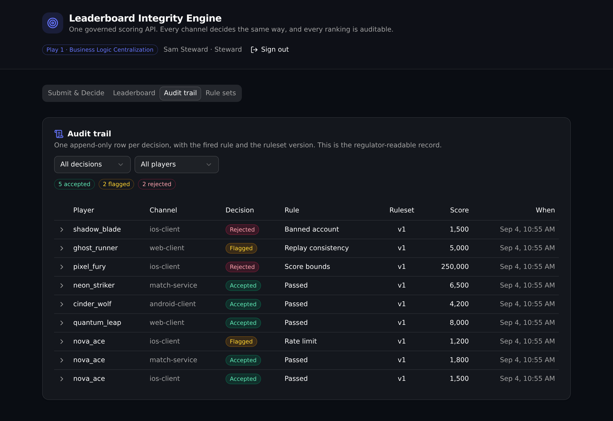

# Leaderboard Integrity Engine

> One governed scoring API that every client, service, and tool calls to submit a player score. A single versioned rule set decides accept, flag, or reject, names the exact rule that fired, and writes an audit row, so every channel scores the same way and no client can seat a bad score on the board.

**Play 1: Business Logic Centralization** · competitive gaming platform.

`6 tables · 10 APIs · 1 function`



## What it demonstrates

Score validation rules usually live scattered across each client build and each backend service. When two channels drift, a cheated score can slip onto the board. This app pulls those rules into ONE governed API layer. Every submission runs through a single versioned rule set (`scoring_rulesets`), so every channel decides the same way, and every decision traces back to the exact rule and the ruleset version that produced it.

That is the Play 1 story ("free the business logic from code, version it, audit it") in a gaming integrity domain. A studio platform engineer publishes a new rule set version, and every channel decides by it at once. A technical reviewer can point at one endpoint and confirm the scoring is correct.

The rules run in order, and the first that decides wins:

1. `banned_account`: reject a banned player before scoring.
2. `score_bounds`: reject a score outside the allowed range.
3. `rate_limit`: flag a player over the per-hour submission cap.
4. `replay_consistency`: flag a score whose points per second exceed the ceiling.
5. Otherwise accept, and seat one leaderboard entry.

Auth is API-layer role-based access control (RBAC), not row-level security. The audit and publish endpoints refuse a request that carries no valid admin token, and publishing a rule set is limited to the steward role. The check happens in the stack, on the caller's own admin row.

## Repo layout

```
xano/
├── index.ts                    the workspace, registering every object
├── tables/                     6 tables (admins auth table, players, scoring_rulesets,
│                               score_submissions, leaderboard_entries, audit_log)
├── functions/decide.ts         decide_score: the ordered rule set, in one place
└── api/                        7 API groups, 10 endpoints
frontend/
└── src/lib/api.ts              the one contract: paths and types derived from the defs
```

## API surface

| Verb | Path | What it enforces |
| --- | --- | --- |
| POST | `/api:scoring/submit` | Runs the active rule set, writes the submission and an audit row, seats a leaderboard entry only on accept. Open to any channel on purpose. |
| GET | `/api:scoring/decision` | The decision, fired rule, ruleset version, and reason for one submission. |
| GET | `/api:leaderboard/rankings` | The ranked board (accepted entries only), with an optional server-side region filter. |
| GET | `/api:audit/submissions` | The append-only decision log, enriched with player and channel. Admin token required. |
| GET | `/api:rulesets/active` | The rule set currently in force. |
| GET | `/api:rulesets/list` | The full version history. |
| POST | `/api:rulesets/publish` | Publishes a new active version and retires the prior one. Steward role required. |
| GET | `/api:players/roster` | Players and their status. |
| POST | `/api:authn/login` | Admin login. Issues an auth token. |
| POST | `/api:seed/run` | Resets and re-seeds sample submissions through the real engine. |

Every channel calls `submit`, so the same rules apply whether the caller is an iOS client, a match service, or an internal tool. The scoring logic lives in one shared function (`decide_score`), which both `submit` and `seed` run, so seeded rows are real engine output and not hand written.

## Quick start

```bash
git clone https://github.com/xano-scratch/leaderboard-integrity-engine
cd leaderboard-integrity-engine
npm install
npx xanots login          # one-time Xano auth
npm run xano:deploy       # builds the frontend, deploys the backend, prints the live URL
```

Open the printed URL, then click **Load sample data** (or `curl -X POST <backend-url>/api:seed/run`) to fill the board and the audit trail. The submit console then produces every decision type on live data: a clean score ranks, a too fast score flags for replay consistency, a banned player rejects, and a burst trips the rate limit.

## Demo accounts

| Email | Password | Role | Can do |
| --- | --- | --- | --- |
| `steward@studio.test` | `steward123` | steward | Read the audit trail, publish a new rule set version |
| `viewer@studio.test` | `viewer123` | viewer | Read the audit trail |

These are public demo credentials for a throwaway environment. Do not reuse them anywhere real.

## FAQ

**Is this row-level security?** No. Access is enforced at the API layer with role-based access control. The audit and publish endpoints read the caller's admin token and role inside the stack and refuse the request when the role does not match.

**Where does the scoring logic live?** In one shared function, `xano/functions/decide.ts` (`decide_score`). Both the public submit endpoint and the seed endpoint call it, so every channel scores the same way and the seed data is real engine output.

**How does versioning work?** Exactly one rule set row is active. A steward publishes a new version through the app, which inserts a new active row and retires the prior one. The same input can flip verdict across versions: a score that passes under v1 can flag under a stricter v2, and the audit row records which version judged it.

**Can I change the rules?** Yes. A steward can publish new bounds and limits from the Rule sets screen, or you can adjust the ordered rules in `decide_score` and redeploy.

**Is this a production reference?** No. It is a scratch proof artifact that runs on seed data, meant to show one governed, auditable API layer that a technical evaluator can read and trust.

## xano.lock, commit it

`xano/xano.lock` is generated by export and deploy. It pins each object's identity, so a later rename renames the object in place instead of dropping and recreating it. It is committed on purpose. Do not hand edit it.
